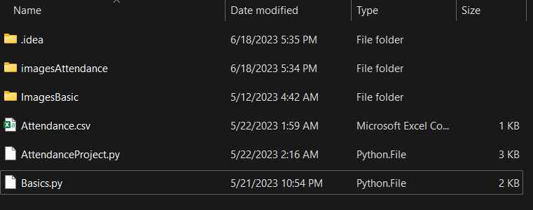
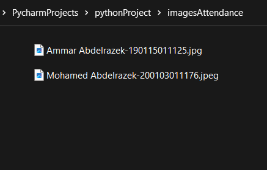
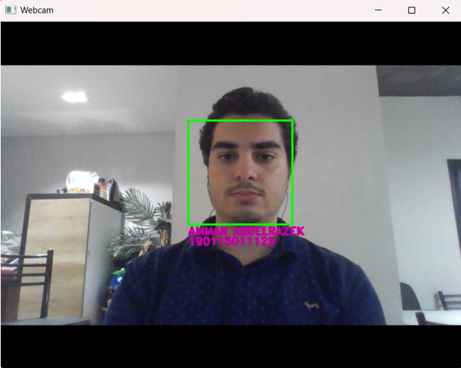
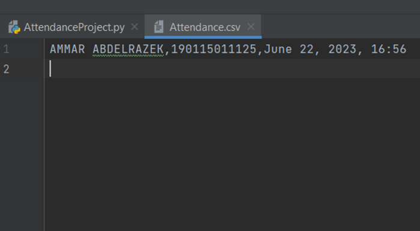
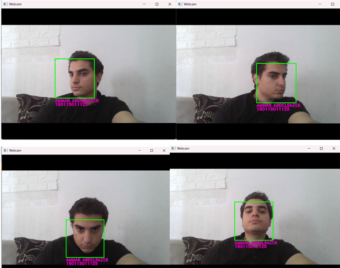

# face-rec
Class Attendance System Using Face Recognition (Python)
The aim of this project is to design and develop a Class Attendance System based on face recognition technology. Traditional methods of taking attendance in classrooms are time-consuming and prone to errors. Leveraging the capabilities of facial recognition algorithms, this system offers a reliable, efficient, and automated solution for managing class attendance.

The face recognition algorithm utilizes machine learning techniques to extract unique facial features from the captured images and matches them against a pre-registered database of student’s faces. By comparing the detected faces with the database, the system can accurately identify students in real-time and mark their attendance automatically.

how to use it:
the folder of the projcet should contain the folder "imagesAttendance" which will be the database for students, "Attendance,csv" in which the reak-time student attendance will automaticly be recorded.

in "imagesAttendance" we put the students photo named with the following format: "Name Surname-StudentNO.jpg".

When we run the program, the camera window pops up and the program starts recognizing the student:

The face detection algorithm works and it draws a rectangle around the recognized face and then the face recognition algorithm identifies the student and writes his/her name & surname under the rectangle.
After that, if we open the file Attendance.csv, we can see that the student's name, surname and his/her student number have been written with the exact date amd time of attendance.

The system also manages to recognize the students from different angles:

The libraries used in the project: CV2, numpy, face-recognition, os, and datetime.
You will need to install these libraries into the python interpreter before running the code. 
